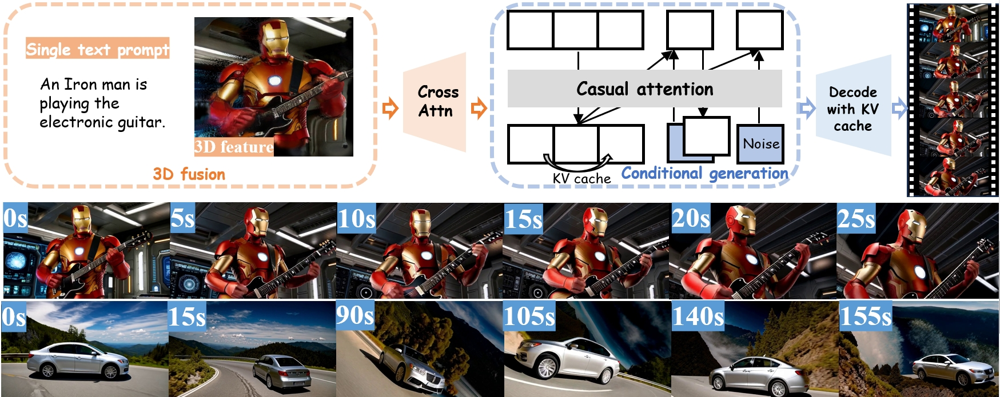

# EndlessWorld: Real-Time 3D-Aware Long Video Generation

Official implementation of **"Endless World: Real-Time 3D-Aware Long Video Generation"**
([arXiv:2512.12430](https://arxiv.org/abs/2512.12430)).

EndlessWorld is a streaming video diffusion model that produces *unbounded-length*,
3D-consistent videos in real time on a single GPU. It builds on the
**Self-Forcing** causal diffusion framework (Wan2.1 T2V-1.3B backbone) and adds a
**Global 3D-Aware Attention** module that injects scene geometry — extracted
on the fly by [AnySplat](https://huggingface.co/lhjiang/anysplat) — into the
conditional embeddings of every autoregressive chunk.

## Method at a glance



* **Conditional autoregressive (self-forcing) training** — frames are denoised
  block-by-block with KV-cache, conditioning each new block on previously
  generated content. See [`pipeline/self_forcing_training.py`](pipeline/self_forcing_training.py)
  and [`wan/modules/causal_model.py`](wan/modules/causal_model.py).
* **Global 3D-Aware Attention** — `CrossAttentionFusion` and `To3D` modules
  (see [`model/base.py`](model/base.py)) ingest 3D Gaussian features produced
  by AnySplat and fuse them with the text embedding, giving the generator a
  persistent geometric memory of the world that was rendered so far.
* **Real-time streaming inference** — the rollout loop in [`inference.py`](inference.py)
  re-extracts 3D features from the most recently decoded chunk and feeds the
  fused embedding back into the causal generator, enabling indefinite
  extension on a single GPU.

## Repository layout

```
.
├── model/                  # DMD / SiD / CausVid models + 3D fusion (CrossAttentionFusion, To3D)
├── pipeline/               # Self-forcing training & causal inference pipelines
├── trainer/                # Distillation, diffusion, GAN, ODE trainers
├── wan/                    # Wan2.1 video diffusion backbone (causal variant)
├── src/                    # AnySplat (3D Gaussian Splatting encoder)
├── utils/                  # Dataset, distributed, scheduler utilities
├── demo_utils/             # Memory management and VAE helpers for the demo
├── configs/                # Training configs (self_forcing_dmd.yaml, self_forcing_sid.yaml)
├── prompts/                # VBench / MovieGen / VidProm benchmark prompts
├── scripts/                # LMDB data preparation and ODE pair generation
├── inference.py            # 3D-aware long video generation (T2V / I2V)
├── train.py                # Multi-GPU FSDP training entry point
├── demo.py                 # Flask streaming demo
├── demo_gradio.py          # Gradio demo
├── test.sh / train.sh      # Minimal example launch scripts
└── evaluate_vbench.sh      # VBench evaluation harness
```

## Installation

```bash
git clone https://github.com/<your-org>/EndlessWorld.git
cd EndlessWorld

conda create -y -n endlessworld python=3.10
conda activate endlessworld

# Install PyTorch (CUDA 12.1 build — adapt to your environment)
pip install torch==2.4.0 torchvision==0.19.0 --index-url https://download.pytorch.org/whl/cu121

# Project dependencies
pip install -r requirements.txt
```

> **Note.** The `src/` directory ships the AnySplat 3D encoder so it can be
> imported directly. The pretrained AnySplat weights are downloaded
> automatically from `lhjiang/anysplat` on first use.

## Pretrained weights

EndlessWorld stacks three pretrained components:

| Component                                | Source                                                  | Where it is loaded |
|------------------------------------------|---------------------------------------------------------|--------------------|
| Wan2.1 T2V-1.3B (backbone + VAE + T5)    | [`Wan-AI/Wan2.1-T2V-1.3B`](https://huggingface.co/Wan-AI/Wan2.1-T2V-1.3B) | `wan_models/Wan2.1-T2V-1.3B/` |
| Wan2.1 T2V-14B (teacher / real-score)    | [`Wan-AI/Wan2.1-T2V-14B`](https://huggingface.co/Wan-AI/Wan2.1-T2V-14B)   | `wan_models/Wan2.1-T2V-14B/`  |
| Self-Forcing DMD warm-start              |[ DMD    ](https://github.com/guandeh17/Self-Forcing)                | `checkpoints/self_forcing_dmd.pt` |
| EndlessWorld 3D-fusion checkpoint        | provided in the EndlessWorld release                    | `checkpoints/model.pt`     |
| AnySplat (3D Gaussian encoder)           | [`lhjiang/anysplat`](https://huggingface.co/lhjiang/anysplat) — auto-downloaded | (HF cache) |

Place the Wan weights under `wan_models/` so the structure looks like:

```
wan_models/
├── Wan2.1-T2V-1.3B/
│   ├── config.json
│   ├── diffusion_pytorch_model.safetensors
│   ├── models_t5_umt5-xxl-enc-bf16.pth
│   └── Wan2.1_VAE.pth
└── Wan2.1-T2V-14B/
    ├── ...
```

## Quick start — long video generation

```bash
bash test.sh
# or, explicitly:
python inference.py \
    --config_path configs/self_forcing_dmd.yaml \
    --baseline_checkpoint_path checkpoints/self_forcing_dmd.pt \
    --checkpoint_path checkpoints/endlessworld.pt \
    --data_path prompts/vidprom_filtered_extended.txt \
    --output_folder outputs/endlessworld/ \
    --num_extension_steps 30 \
    --use_ema
```

* `--num_extension_steps N` — produces `~21 + 3·N` latent frames per prompt,
  i.e. roughly a 30-second clip at `N=30`.
* `--i2v` — image-to-video (the first frame comes from `data_path`).
* `--num_samples K` — generate `K` independent rollouts per prompt.

The pipeline writes one `.mp4` file per prompt to `--output_folder`.

## Training

```bash
bash train.sh
# or, explicitly:
torchrun --nproc_per_node=4 train.py \
    --config_path configs/self_forcing_dmd.yaml \
    --logdir logs/endlessworld
```

The default config trains the DMD score-distillation objective on top of a
Self-Forcing warm-start. Update `generator_ckpt:` in
[`configs/self_forcing_dmd.yaml`](configs/self_forcing_dmd.yaml) before launching.

### Data preparation

Training expects an LMDB shard of pre-encoded latents. See
[`scripts/create_lmdb_iterative.py`](scripts/create_lmdb_iterative.py) and
[`scripts/create_lmdb_14b_shards.py`](scripts/create_lmdb_14b_shards.py). Text
prompts for distillation come from `prompts/vidprom_filtered_extended.txt`.

## Demo

```bash
python demo_gradio.py   # interactive Gradio interface
python demo.py          # Flask + Socket.IO streaming server
```

## Evaluation

VBench:

```bash
# 1. Generate VBench clips:
python inference.py \
    --config_path configs/self_forcing_dmd.yaml \
    --baseline_checkpoint_path checkpoints/self_forcing_dmd.pt \
    --checkpoint_path checkpoints/endlessworld.pt \
    --data_path prompts/vbench/all_dimension.txt \
    --extended_prompt_path prompts/vbench/all_dimension_extended.txt \
    --output_folder outputs/endlessworld_vbench/ \
    --use_ema

# 2. Score (requires the official VBench evaluator):
bash evaluate_vbench.sh
```

## Citation

If you find EndlessWorld useful in your work, please cite:

```bibtex
@article{endlessworld2025,
  title   = {Endless World: Real-Time 3D-Aware Long Video Generation},
  journal = {arXiv preprint arXiv:2512.12430},
  year    = {2025}
}
```

## Acknowledgements

EndlessWorld builds upon several excellent prior works whose code we directly
reuse or adapt:

* **Self-Forcing** — the causal diffusion / DMD training framework. [[code]](https://github.com/guandeh17/Self-Forcing)
* **Wan2.1** — the underlying text-to-video diffusion backbone. [[code]](https://github.com/Wan-Video/Wan2.1)
* **AnySplat** — the feed-forward 3D Gaussian Splatting encoder used as our 3D feature provider. [[code]](https://github.com/OpenRobotLab/AnySplat) · [[weights]](https://huggingface.co/lhjiang/anysplat)
* **VBench** — long-video evaluation suite.

## License

This project is released under the license in [LICENSE](LICENSE). The third-party
weights and code retain their original licenses (see the upstream Wan2.1,
Self-Forcing, and AnySplat repositories).
